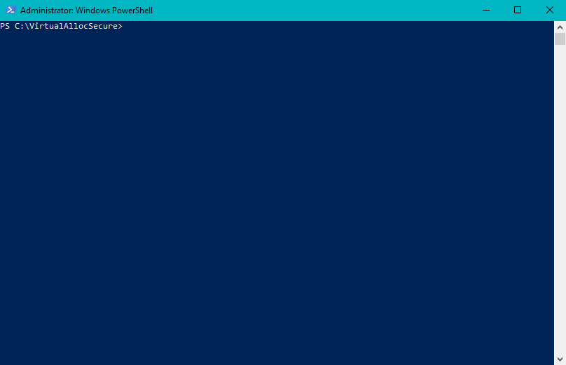

# VirtualAllocSecure

VirtualAllocSecure is a Proof-of-Concept for Windows that hacks page table entries to enable AMD's Secure Memory Encryption on supported processors.

## Background

Secure Memory Encryption is a technology available on certain SKUs of AMDs recent processors that transparantly encrypts memory contents before writing to DRAM. This technology could be valuable in protecting secrets from physical attacks on the memory bus and is used in AMD's Secure Encrypted Vitualization technology.

## PoC

A dynamically-linked library (VirtualAllocSecure.dll) which exposes a single function - *VirtualAllocSecure* - which acts in much the same way as VirtualAlloc.
When a caller calls VirtualAllocSecure, VirtualAlloc is first called to reserve+commit the relevant memory for the process. The library will then call a companion driver (SecureMemoryEncryptionDriver) which will enable memory encryption by manually setting the C-bit in the relevant PTEs for the newly allocated memory region pages.

**NOTE:** This is extremely hacky and could lead to system instability!

*Tested on my Ryzen 2700X with virtualization fucntionality disabled in the BIOS*

## Library usage

VirtualAllocSecure.dll can be dynamically loaded by any process. To allocated a virtual memory region 

    typedef PVOID(*VirtualAllocSecure)(SIZE_T Size, ULONG Protect);

    HMODULE lib = LoadLibraryA("VirtualAllocSecure.dll");

    PCHAR buffer = pVirtualAllocSecure(0x100, PAGE_READWRITE);
    
    VirtualFree(buffer, 0, MEM_RELEASE);
